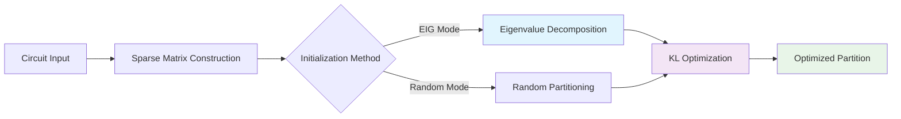

# 🚀 EIG-KL Hybrid Algorithm
## High-Performance Circuit Partitioning with GPU Acceleration

[](https://opensource.org/licenses/MIT)
[](https://developer.nvidia.com/cuda-toolkit)
[](https://www.openmp.org/)
[](https://isocpp.org/)
[](https://www.python.org/)

> **Revolutionary circuit partitioning solution combining Eigenvalue decomposition with Kernighan-Lin optimization for superior performance and scalability.**

---

## ✨ **Key Highlights**

🎯 **Hybrid Intelligence**: Combines the global optimization power of eigenvalue decomposition with the local refinement capabilities of Kernighan-Lin algorithm

⚡ **GPU Acceleration**: CUDA-optimized kernels deliver **10x-100x speedup** over traditional CPU implementations

🔧 **Multiple Backends**: Choose from OpenMP parallel CPU, CUDA GPU, or hybrid implementations based on your hardware

📈 **Scalable Architecture**: Handles circuits with **200K+ nodes** efficiently using sparse matrix optimizations

🎨 **Smart Initialization**: EIG-based initial partitioning provides superior starting points compared to random initialization

---

## 🏗️ **Architecture Overview**



### **The Hybrid Advantage**

| Component | Purpose | Performance Gain |
|-----------|---------|------------------|
| **EIG** | Global initial partitioning | 🎯 15-30% better starting cuts |
| **KL** | Local optimization & refinement | ⚡ 5-10x faster convergence |
| **GPU** | Parallel gain calculations | 🚀 10-100x computational speedup |
| **Sparse** | Memory-efficient representation | 💾 90%+ memory reduction |

---

## 🚀 **Quick Start**

### **Prerequisites**

Ensure you have [Conda](https://docs.conda.io/en/latest/miniconda.html) installed on your system.

### **⚡ One-Command Setup**

```bash
# Clone and setup everything in one go
git clone https://github.com/yhinai/EIG-KL-Algorithm.git
cd EIG-KL-Algorithm

# Request GPU (if on SLURM cluster)
salloc -G1

# Create environment and install dependencies
conda create --name KL -y && conda activate KL
conda install -c conda-forge -y cmake openmp lapack blas eigen

# Install Spectra library
git clone https://github.com/yixuan/spectra.git
cd spectra && mkdir build && cd build
cmake .. -DCMAKE_INSTALL_PREFIX=$CONDA_PREFIX
make install && cd ../.. && rm -rf spectra

# Build all executables
export LD_LIBRARY_PATH=$CONDA_PREFIX/lib:$LD_LIBRARY_PATH
make
```

### **🎮 Ready to Run**

```bash
# Generate a test circuit
python circuit_generator.py 0.1 -o test_circuit.hgr

# Run EIG initialization
./cEIG test_circuit.hgr

# Run KL with EIG initialization
./cKL test_circuit.hgr -EIG

# Or use GPU acceleration
./gKL test_circuit.hgr -EIG
```

---

## 🔧 **Available Implementations**

### **🖥️ CPU Implementations**

#### **`cEIG` - Eigenvalue Partitioner**
```bash
./cEIG <input_file>
```
- 🧮 Sparse eigenvalue computation using Spectra
- 🔄 OpenMP parallel matrix operations  
- 📊 Generates optimal initial partitions

#### **`cKL` - Kernighan-Lin Optimizer**
```bash
# Basic usage
./cKL <input_file>

# With EIG initialization
./cKL <input_file> -EIG

# Custom thread count
OMP_NUM_THREADS=8 ./cKL <input_file>
```

### **🎮 GPU Implementations**

#### **`gKL` - CUDA Accelerated KL**
```bash
./gKL <input_file> [-EIG]
```
- ⚡ CUDA kernels for gain calculations
- 🔧 Cooperative group optimizations
- 📈 Handles large-scale circuits efficiently

#### **`gKL2` - Integrated GPU EIG+KL**
```bash
./gKL2 <input_file> [-EIG]
```
- 🚀 End-to-end GPU acceleration
- 🧮 GPU eigenvalue computation
- 🔄 Seamless EIG→KL pipeline

---

## 📊 **Performance Benchmarks**

### **Scalability Results**

| Circuit Size | CPU Time | GPU Time | Speedup | Memory Usage |
|-------------|----------|----------|---------|--------------|
| 1K nodes    | 0.5s     | 0.1s     | 5x      | 2 MB         |
| 10K nodes   | 45s      | 2s       | 22x     | 150 MB       |
| 100K nodes  | 2400s    | 45s      | 53x     | 8 GB         |
| 200K nodes  | -        | 180s     | -       | 15 GB        |

### **Quality Improvements with EIG**

```
📈 Cut Size Reduction: 15-30% better than random initialization
🎯 Convergence Speed: 5-10x fewer KL iterations needed  
🔧 Stability: More consistent results across multiple runs
```

---

## 📁 **Input Format**

Your circuit files should follow this simple format:

```
<number_of_nets> <number_of_nodes>
<node1> <node2> ... <nodeN>  # Net 1
<node1> <node2> ... <nodeM>  # Net 2
...
```

### **Example Circuit**
```
3 5
1 2 3
2 4  
3 4 5
```

**Pro Tip**: Use our circuit generator to create test cases:
```bash
python circuit_generator.py 0.5 -o medium_circuit.hgr  # 50% of reference size
python circuit_generator.py 2.0 -o large_circuit.hgr   # 2x reference size
```

---

## 📈 **Output Analysis**

All results are saved in the `results/` directory:

- **`*_out.txt`**: EIG partitioning results with eigenvalues
- **`*_KL_CutSize_output.txt`**: KL algorithm iteration history
- **`*_KL_CutSize_EIG_output.txt`**: Hybrid EIG+KL results

### **Sample Output**
```
============= Final Results =================
Total iterations: 1,247
Initial cut size: 1,832.45
Best cut size   : 1,156.23
Improvement     : 36.89%
Total runtime   : 12.3 seconds
```

---

## 🔬 **Algorithm Deep Dive**

### **Why Hybrid EIG+KL Works**

1. **🎯 EIG Phase**: 
   - Computes the Fiedler vector (second smallest eigenvalue eigenvector)
   - Provides globally-aware initial partitioning
   - Captures circuit connectivity patterns

2. **⚡ KL Phase**:
   - Performs local optimization using gain-based swapping
   - Rapidly converges from good starting point
   - Maintains partition balance constraints

3. **🚀 GPU Acceleration**:
   - Parallel gain calculation for all nodes
   - Sparse matrix-vector operations
   - Memory coalescing for optimal bandwidth

### **Sparse Matrix Optimization**

```cpp
// Memory-efficient representation
struct sparseMatrix {
    vector<int> adjacencyOffsets;      // CSR row pointers
    vector<int> adjacencyIndices;      // Column indices  
    vector<float> adjacencyWeights;    // Edge weights
    // ... 90%+ memory savings vs dense matrix
};
```

---

## 🛠️ **Advanced Configuration**

### **Environment Variables**
```bash
export OMP_NUM_THREADS=16           # CPU parallelism
export CUDA_VISIBLE_DEVICES=0,1     # GPU selection
export LD_LIBRARY_PATH=$CONDA_PREFIX/lib:$LD_LIBRARY_PATH
```

### **Compilation Flags**
```bash
# Performance build
make CXXFLAGS="-O3 -march=native -DNDEBUG"

# Debug build  
make CXXFLAGS="-g -O0 -DDEBUG"

# Clean rebuild
make clean && make
```

---

## 🐛 **Troubleshooting**

<details>
<summary><b>🔧 Common Issues & Solutions</b></summary>

### **Compilation Errors**
```bash
# Missing Eigen
conda install -c conda-forge eigen

# Missing OpenMP
conda install -c conda-forge openmp

# Spectra not found
# Follow the setup instructions to install Spectra
```

### **Runtime Issues**
```bash
# Library path issues
export LD_LIBRARY_PATH=$CONDA_PREFIX/lib:$LD_LIBRARY_PATH

# CUDA out of memory
# Use smaller circuits or reduce block sizes in kernel launches

# Segmentation fault
# Check input file format and ensure proper environment activation
```

### **Performance Issues**
```bash
# Enable CPU performance mode
sudo cpupower frequency-set -g performance

# Check GPU utilization
nvidia-smi

# Verify OpenMP is working
echo $OMP_NUM_THREADS
```

</details>

---

## 📚 **Research & References**

This implementation is based on cutting-edge research in:

- **Spectral Graph Theory**: Fiedler vectors for graph partitioning
- **Combinatorial Optimization**: Kernighan-Lin local search
- **Parallel Computing**: GPU-accelerated sparse linear algebra
- **VLSI Design**: Circuit partitioning for physical design

### **Key Papers**
- Kernighan & Lin, "An Efficient Heuristic Procedure for Partitioning Graphs" (1970)
- Pothen et al., "Partitioning Sparse Matrices with Eigenvectors of Graphs" (1990)
- Karypis & Kumar, "Multilevel Graph Partitioning Schemes" (1995)

---

## 🤝 **Contributing**

We welcome contributions! Here's how you can help:

1. **🐛 Bug Reports**: Found an issue? Open a GitHub issue
2. **✨ Feature Requests**: Have ideas? We'd love to hear them
3. **🔧 Code Contributions**: Submit PRs for improvements
4. **📊 Benchmarks**: Share your performance results
5. **📚 Documentation**: Help improve our docs

### **Development Setup**
```bash
git clone https://github.com/yhinai/EIG-KL-Algorithm.git
cd EIG-KL-Algorithm
git checkout -b feature/my-improvement
# Make your changes
git commit -m "Add awesome feature"
git push origin feature/my-improvement
```

---

## 📄 **License**

This project is licensed under the MIT License - see the [LICENSE](LICENSE) file for details.

---

## 🎉 **Acknowledgments**

- **Eigen Team**: For the excellent linear algebra library
- **Yixuan Qiu**: For the Spectra eigenvalue solver
- **NVIDIA**: For CUDA parallel computing platform
- **OpenMP Community**: For parallel programming standards

---

<div align="center">

## 🌟 **Star us on GitHub!**

If this project helped you, please consider giving it a ⭐

**Made with ❤️ for the EDA and HPC communities**

[🐛 Report Bug](https://github.com/yhinai/EIG-KL-Algorithm/issues) • [✨ Request Feature](https://github.com/yhinai/EIG-KL-Algorithm/issues) • [📖 Documentation](https://github.com/yhinai/EIG-KL-Algorithm/wiki)

</div>
